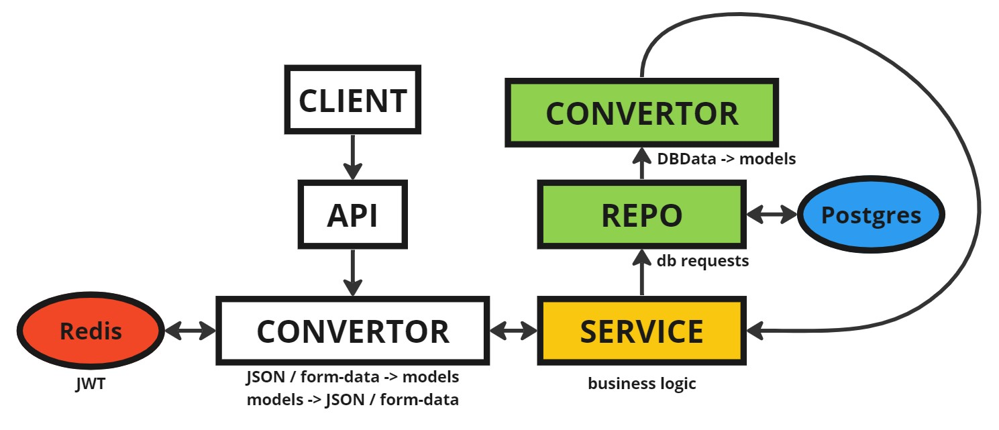
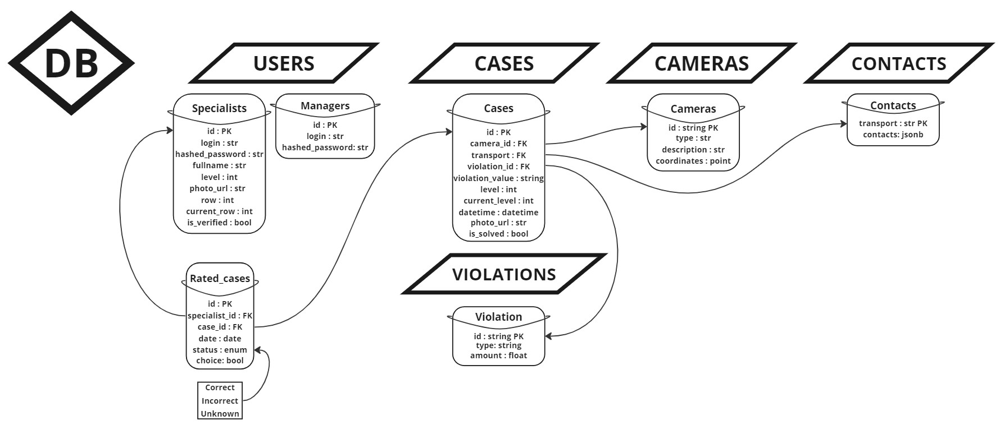

# IT_LAB_INIT

## О проеке

Сервис представленный в данном репозитории способен принимать и обрабатывать случаи 
правонарушений, загружаемые в него.  

Для загрузки случаев разработан *Decoder*, который конвертирует поступающие данные о случаях
из бинарной строки в необходимую структуру данных.

Имеются 2 основные группы пользователей - *проверяющие
специалисты* и *руководители*. То, что могут делать *руководители*, не могут делать
*проверяющие специалисты* и наоборот.  
Для пользователей сервиса разработана авторизация
через `Access + Refresh Tokens` (*JWT*).  

*Проверяющие специалисты* способны изменять и получать информацию о себе, оценивать случаи,
получать список случаев в соответствии со своим уровнем компетенции (он берется из `Access Tokens`,
который всегда передается в заголовках запроса), получать список решенных кейсов (для обучения),
смотреть рейтинг самых продуктивных специалистов.

*Руководители* способны получать максимально подробную информацию по каждому из кейсов, а также получать
информацию о количестве решнных случаев для каждого из проверяющих специалистов.

Регистрация руководителей происходит программно путем изменения данных в структуре в файле `cmd/loads/loadManager.go`,
а именно полей `Login` и `Password`:
```
manager := models.ManagerBase{
	Login:    "testLogin",
	Password: "Password1",
}
```
После изменения необходимо выполнить команду из папки `/cmd`:
```bash
go run loads/loadManager.go
```

Для загрузки контанктных данных о пользователе, а также данных о штрафах необходимо поместить *excel* таблицы в папку
`internal/exloads/exfiles`. Пример того, как должны выглядеть эти файлы лежат в той же директории. После
чего необходимо вызвать команду из папки `/cmd`:
```bash
go run loads/loadContacts.go
go run loads/loadViolation.go
```
Для контакных данных и данных о штрафах соотвественно.

При достижении консенсуса между *k* проверяющими специалистами, нарушителю на почту высылается письмо с текстом,
описывающим его правонарушение.

Каждые `REPORTING_PERIOD` дней обновляется уровень компитенции специалистов:
- 10% лучших получают +1 уровень компитенции
- 10% худших получают -1 уровень компитенции, если их уровень больше 1
- Не получают ничего те специалисты, которые оценили меньше `j` кейсов и оставшиеся 80% от всех специалистов


## Фичи
- Встроенное логирование всех сервисов проекта
- Трассировка всего проекта от начала работы хендлера и до взаимодействия с БД
- Обработка всевозможных пограничных случаев


## Архитектура

В данном сервисе используется чистая архитектура и сам проект содержит 3 основных слоя: слой конвертора
(работа хендлера), сервисный слой (содержит всю основную бизнес логику) и репозиторный слой (работа с бд).  

Ниже представлено фото, демонстрирующее архитектуру данного сервиса:




## Деплой

Для начала следует открыть терминал и перейти в необходимую вам дирректорию,
после чего склонировать репозиторий:

```bash
git clone https://github.com/gl1n0m3c/IT_LAB_INIT.git
```

Далее необходимо настроить файл виртуального окружения. Для этого создайте
в корне склонированного проекта файл `config.env` и скопируйте в него содержимое
файла `config_example.env`. Заполните файл в соотвествии с конфигурацией вашего проекта.

***Примечание**: `0` означает, что на этом месте должно стоять число*

После настройки виртуального окружения можно перейти к более насущной проблеме - развёртыванию
проекта. Это можно сделать одним из представленных способов:

- ### Через Docker-Compose:
    - Перейдите в директорию `deploy/` и выполните команду:
        ```bash
        docker-compose --env-file ../config.env up
        ```
    - Подождите, пока соберутся и запустятся Docker контейнеры (в среднем от 1 до 3 минут)
    - Перейдите в корневую директорию проекта и выполните команду:
       ```bash
       goose -dir internal/migrations postgres "postgresql://<имя_пользователя>:<пароль_пользователя>@<хост_вашей_бд>:<порт_вашей_бд>/<название_схемы>?sslmode=disable" up
       ```

- ### Вручную:
    - Предполагается, что у вас уже есть запущенные сервисы `Posgres`, `Redis` и `Jaeger` (при необходимости)
    - Перейдите в директорию `cmd/` и установите все зависимости, выполнив команду:
        ```bash
        go mod tidy
        ```
    - Запустите проект:
        ```bash
        go run main.go
        ```
    - Переходим в консоли в корневую директорию проекта
   - Пишем команду:
     ```bash
     goose -dir internal/migrations postgres "postgresql://<имя_пользователя>:<пароль_пользователя>@<хост_вашей_бд>:<порт_вашей_бд>/<название_схемы>?sslmode=disable" up
     ```

На этом развертка сервиса заканчивается, далее можно ознакомиться с документацией *api* в формате *swagger*:
http://127.0.0.1:8080/swagger/index.html

В *swagger* могут встречать такие типы вовзращаемых полей:
```
"some_key": {
    "some_type": some_type_data,
    "valid": true
}
```
Эта запись означает, что значение у ключа `some_key` может быть как `some_type` (float64 -> float, int64 -> int),
так и `null`

---
***Пример***:
```
"fullname": {
    "string": "string",
    "valid": true
}
```
Эта запись говорит, что по ключу `"fullname"` мы можем получить как строковое значение, так и null, в случае,
если у проверяющего специалиста не установлено полное имя.

---

**Ниже представлена схема БД:**


